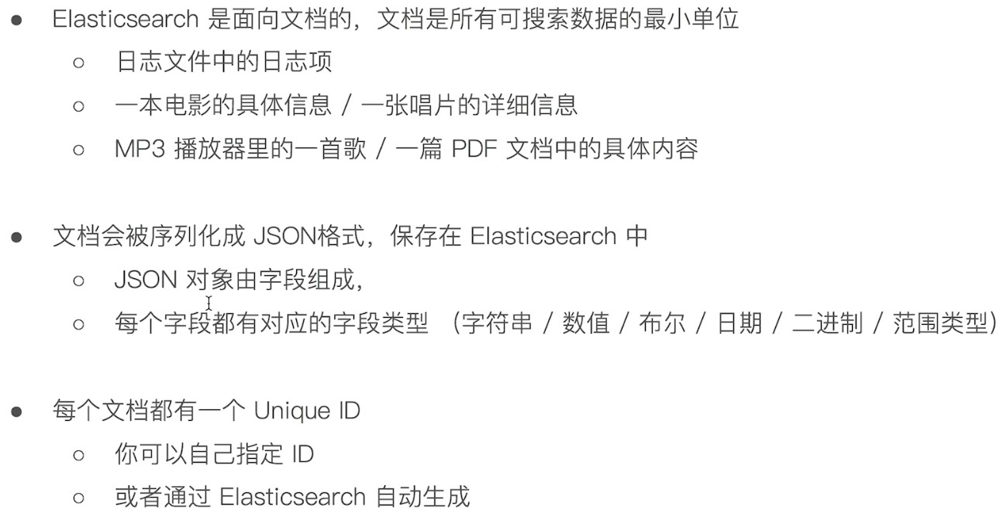
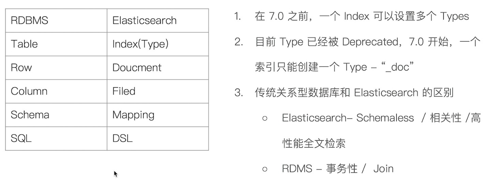
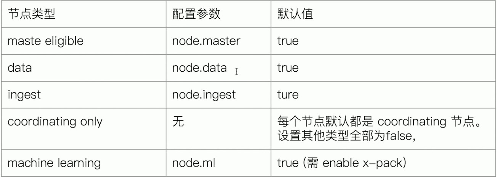

## Elastic Search

### 文档 (Document)



---

### 文档的元数据


---

### 索引


## Type


### 抽象与对比

be.jpg

### 配置节点类型

* 开发环境中一个节点可以承担多种任务

* 生产环境中应该设置单一的节点

  

###  分片

* 主分片

  

* 副本

  


### 分片的设定

* 对于生产环境中分片的设定,需要提前做好容量的规划
  - 分片数设置过小
    - 导致后续无法增加节点实现水平扩展
    - 单个分片的数据量太大, 导致数据重新分配耗时
  - 分片数设置过大, 7.0开始,默认主分片设置为一,解决了over-sharding的问题
    -  影响搜索结果的相关性打分, 影响统计结果的准确性
    -  单个节点上过多的分片,会导致资源浪费, 同时会影响性能

### 查看集群的健康状况

GET /_cluster/health

``` json
{
  "cluster_name" : "elasticsearch",
  "status" : "green",                     	// green 主分片与副本都正常分配
    										// yellow 主分片正常分配,有副本分片未能正常分配
    										// red 主分片未能正常分配
  "timed_out" : false,
  "number_of_nodes" : 1,
  "number_of_data_nodes" : 1,
  "active_primary_shards" : 6,
  "active_shards" : 6,
  "relocating_shards" : 0,
  "initializing_shards" : 0,
  "unassigned_shards" : 0,
  "delayed_unassigned_shards" : 0,
  "number_of_pending_tasks" : 0,
  "number_of_in_flight_fetch" : 0,
  "task_max_waiting_in_queue_millis" : 0,
  "active_shards_percent_as_number" : 100.0
}
```

