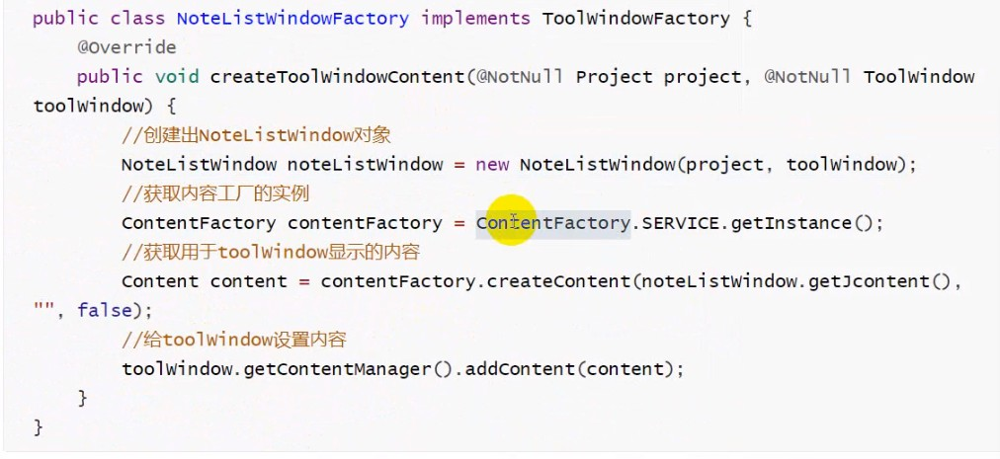
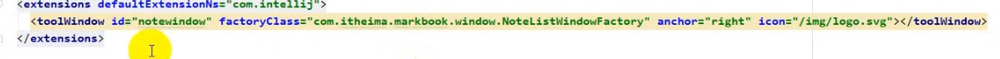
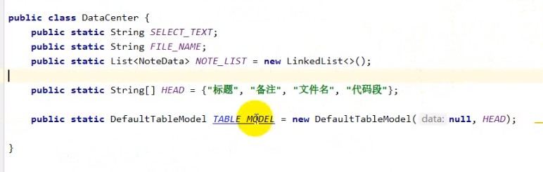
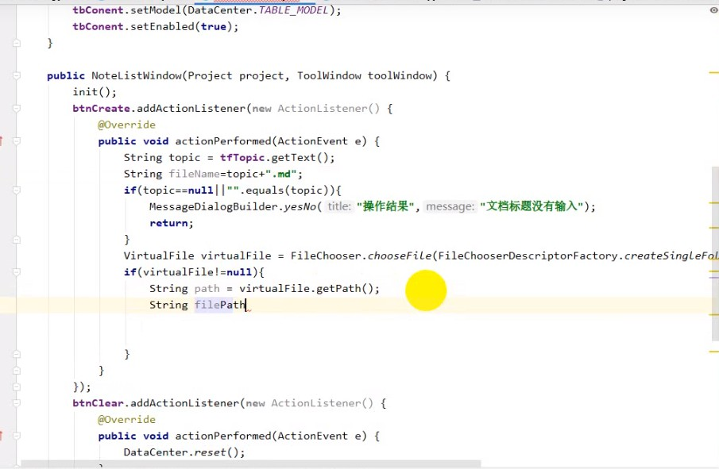

##  intelliJ plugin 开发

###  基础插件开发

开发助手,一般idea 会自带工具 Using DevKit

plugin.xml

``` java
.IntelliJIDEAx0/
└── plugins
    └── sample.jar
        ├── com/foo/...
        │   ...
        │   ...
        └── META-INF
            ├── plugin.xml
            ├── pluginIcon.svg
            └── pluginIcon_dark.svg
```

``` xml
<idea-plugin>
	<id> 插件 ID </id>
    <name> 插件名 </name>
    <version> 插件版本 </version>
    <vendor email='' url=''>发行方</vendor>
    
    <description>插件描述
    </description>
    
    <chage-notes>版本日志
    </chage-notes>
    
    <idea-version since-build='' until-build=''>支持版本
    </idea-version>
    
    <depends> 插件依赖
    </depends>
    
    <extensions>
    </extensions>
    
    <actions>
        <action></action>
    </actions>
</idea-plugin>
```

AnAction

ToolsMenu (tools 菜单按钮)

插件通知服务接口 NotificationGroup Notification Notifications

ApplicationComponent  在 idea 启动时候初始化,整个 idea 只有一个实例

ProjectComponent IDEA 会为每一个 Project 实例创建对应级别的组件

ModuleComponent IDEA 会为每一个已经加载的 Project 中的每一个模块创建 Module 级别的 组件

``` xml
<application-components>
	<component>
    	<implementation-class>启动会调用 ApplicationComponent 接口的实现类
        </implementation-class>
    </component>
</application-components>
```

对话框接口 需要继承 DialogWrapper 接口

需要重写构造和createCenterPanel 创建中间的嵌入式的面板

``` java
public class TestDialog extends DialogWrapper {
    private JLabel label;
    
    protected TestDialog() {
        super(true);
        setTitle("标题栏");
        init();
    }
    // 中间的 panel
    protected JComponent createCenterPanel() {
        Jpanel panel = new Jpanel();
        label = new JLable("按钮标题");
        panel.add(label);
        return panel;
    }
    
    // 下面的 panel
    protected JComponent createSouthPanel() {
        Jpanel panel = new Jpanel();
        JButton label = new JButton("按钮标题");
        label.addActionListener(e -> 
			label.setText("可以改变文本"); // 可以通过发 http 协议更改内容
        )
        panel.add(label);
        return panel;
    }
}
```

```java
public class TestApplication implements ApplicationComponent {
	
    public void initComponent() {
        TestDialog dialog = new TestDialog();
        dialog.show();
    }
}
```

### 笔记插件

获取编辑器中已经选中的文本

添加右键子菜单 Anaction name: 菜单文本 Description: 插件描述

``` java
// EditorPopupMenu 编辑器里面的右键弹出框
public class TestAnAction extends Anaction {
	
    @over
    public void actionPerFormed(AnActionEvent e) {
        // 获取编辑器中的文本
        Editor editor = e.getRequriredData(CommonDataKeys.EDITOR);
        SelectionModel selectionModel = editor.getSelectionModel();
        // 被选中的文本
        String selectedText = selectionModel.getSelectedText();
        // 文件名
        String fileName = e.getRequriredData(CommonDataKeysPSI_FILE)
        	.getviewProvider().getVirtualFile().getName();
        
        // DOTO 填充类容
        
        // 添加弹出窗口
        TestDialog testDialog = new TestDialog();
        testDialog.show();
    }
}
```

弹出对话框获取用户编辑的内容

``` java
// EditorPopupMenu 编辑器里面的右键弹出框
public class TestDialog extends DialogWrapper {
	
    private EditorTextField t1;
    private EditorTextField t2;
    
    protected TestDialog() {
        super(true);
        setTitle("标题栏");
        init();
    }
    // 中间的 panel
    protected JComponent createCenterPanel() {
        Jpanel panel = new Jpanel(new BorderLayout);
        t1 = new EditorTextField("text1");
        t2 = new EditorTextField("text2");
        t2.setPreFerredSize(new Dimension(200, 100));
        panel.add(t1, BorderLayout.NORTH);
        panel.add(t2, BorderLayout.CENTER);
        return panel;
    }
    
    // 下面的 panel
    protected JComponent createSouthPanel() {
        Jpanel panel = new Jpanel();
        JButton label = new JButton("按钮标题");
        label.addActionListener(e -> 
			String t1 = t1.getText();
            String t2 = t2.getText();
			// DOTO 填充类容
        )
        panel.add(label);
        return panel;
    }
}
```

使用 ToolWindow 展示笔记列表

  创建 swing UI Designer  > GUI Form

​	Jpanel 布局 JScrollPane 布局滚轮

​	button 创建 actionListener 事件

​	在 ToolWindow 添加表格









